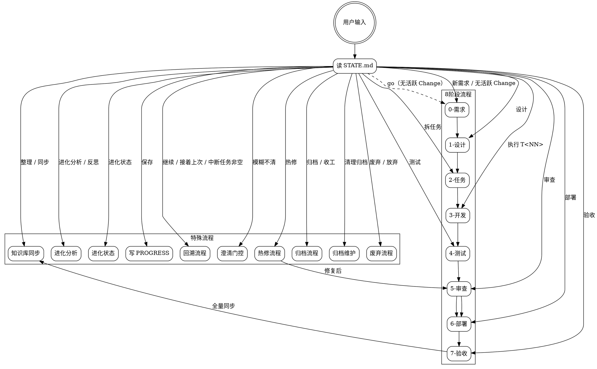

# 路由决策流程图

> SKILL.md 路由逻辑的可视化参考。按需加载，不随 SKILL.md 自动加载。

```dot
digraph flow_go_routing {
  rankdir=TB;
  node [shape=box, style=rounded];

  start [label="用户输入", shape=doublecircle];
  read_state [label="读 STATE.md"];

  start -> read_state;

  // 特殊流程
  subgraph cluster_special {
    label="特殊流程";
    recall [label="回溯流程"];
    hotfix [label="热修流程"];
    archive [label="归档流程"];
    archive_cleanup [label="归档维护"];
    abandon [label="废弃流程"];
    neat [label="知识库同步"];
    evolve [label="进化分析"];
    evolve_status [label="进化状态"];
    save [label="写 PROGRESS"];
    ambiguous [label="澄清门控"];
  }

  // 正常流程
  subgraph cluster_normal {
    label="8阶段流程";
    r0 [label="0-需求"];
    r1 [label="1-设计"];
    r2 [label="2-任务"];
    r3 [label="3-开发"];
    r4 [label="4-测试"];
    r5 [label="5-审查"];
    r6 [label="6-部署"];
    r7 [label="7-验收"];

    r0 -> r1 -> r2 -> r3 -> r4 -> r5 -> r6 -> r7;
  }

  // 阶段直入路由
  read_state -> r0 [label="新需求 / 无活跃 Change"];
  read_state -> r1 [label="设计"];
  read_state -> r2 [label="拆任务"];
  read_state -> r3 [label="执行 T<NN>"];
  read_state -> r4 [label="测试"];
  read_state -> r5 [label="审查"];
  read_state -> r6 [label="部署"];
  read_state -> r7 [label="验收"];

  // go/下一步：有活跃 Change 时进入当前阶段下一步
  read_state -> r0 [label="go（无活跃 Change）" style=dashed];
  edge [comment="go有活跃Change时由STATE.md决定阶段"];

  // 特殊流程路由
  read_state -> recall [label="继续 / 接着上次 / 中断任务非空"];
  read_state -> hotfix [label="热修"];
  read_state -> archive [label="归档 / 收工"];
  read_state -> archive_cleanup [label="清理归档"];
  read_state -> abandon [label="废弃 / 放弃"];
  read_state -> neat [label="整理 / 同步"];
  read_state -> evolve [label="进化分析 / 反思"];
  read_state -> evolve_status [label="进化状态"];
  read_state -> save [label="保存"];
  read_state -> ambiguous [label="模糊不清"];

  // 热修必须走审查→部署
  hotfix -> r5 [label="修复后"];
  r5 -> r6;

  // 验收后触发知识库同步
  r7 -> neat [label="全量同步"];
}
```
